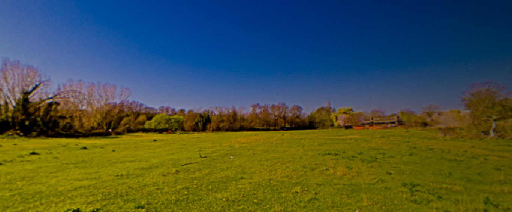
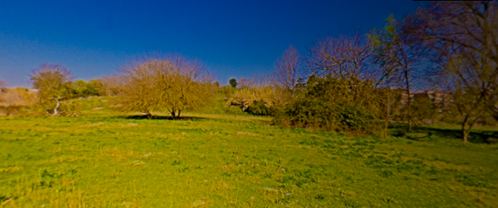
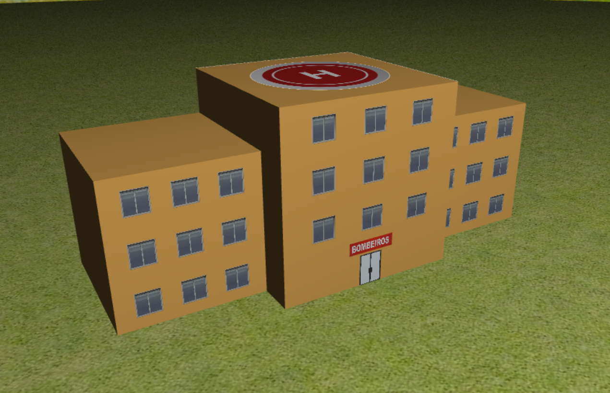
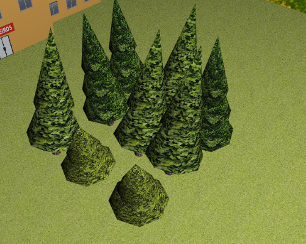
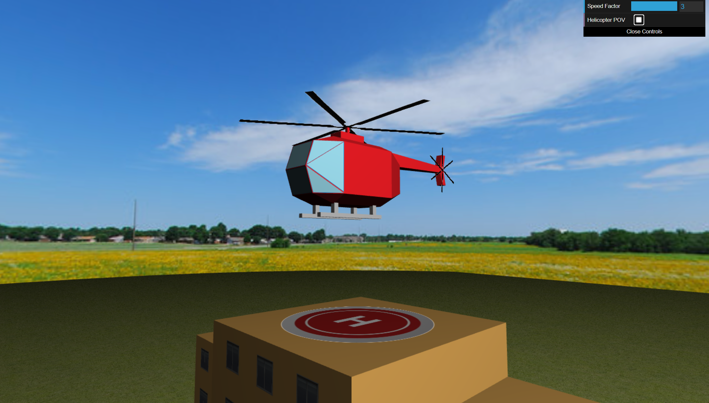
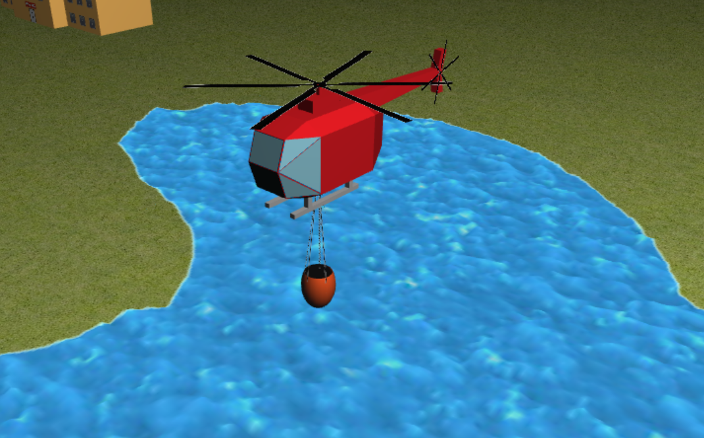
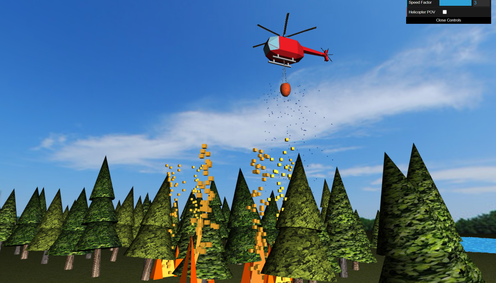

# CG 2024/2025

## Group T02G07

## Project Notes

- Earth sphere done without problems.

- Panorama created without problems.

- Building was created. We had an initial problem when the panorama was being drawn, the building catched the color of the background. The problem was fixed with the help of the teacher and the monitor.

- The forest was created.

- The helicopter was modeled based on a SketchUp draft model. We used textures for the helicopter blades. The bucket is a Y-stretched sphere, sliced at the top. The bucket cables consist in a cone that uses a transparent texture, where only some black lines are visible (the cables).

- All controls were implemented.

- We added sparks and water droplets to add more realism. This doesn't affect performance too much.

