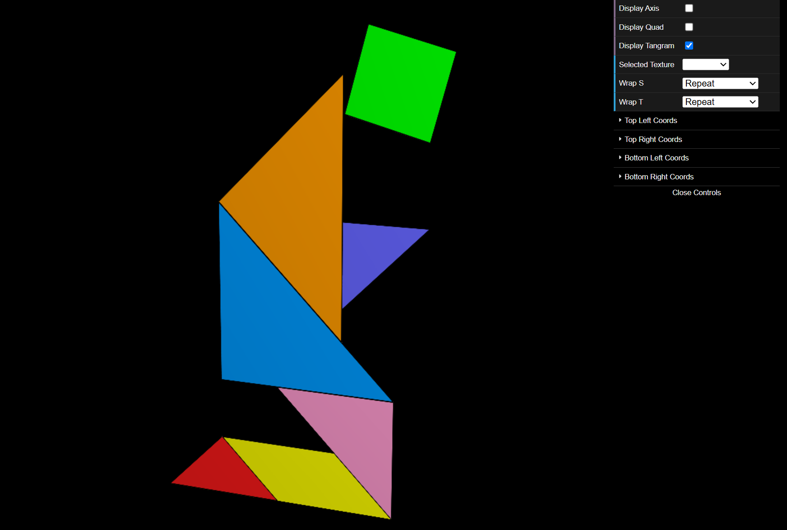
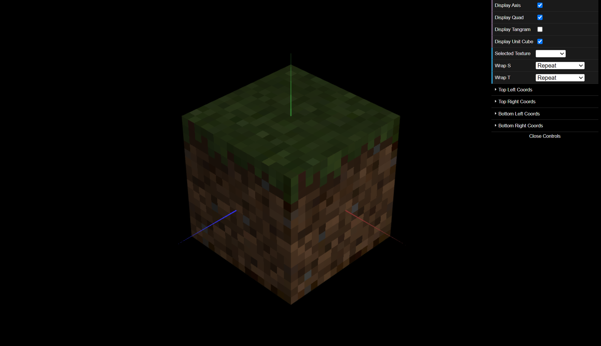

# CG 2024/2025

## Group T02G07

## TP 4 Notes

- In exercise 1 we were able to do everything that was asked. The "tangram-lines" texture was very helpful to better understand the order of the vertices when defining the texCoords for each Tangram piece.

- In exercise 2 we were able to do everything that was asked. We noticed the textures were indeed blurred due to the linear interpolation that is done by default. To make the textures sharp as expected, we changed the filtering type by using the suggested commented line.

